# Primeiros passos com terraform
# Aluno: Robson do Amaral DIógenes

## Inicialização do Terraform
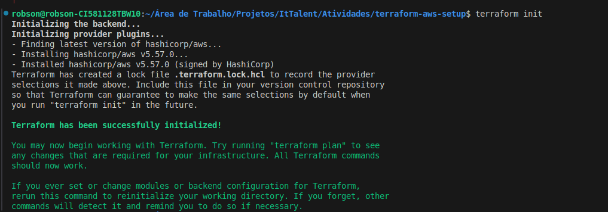

## Plano de execução do Terraform
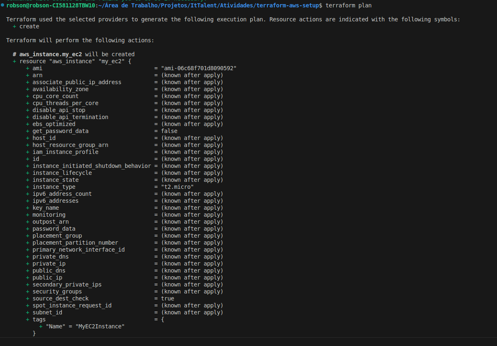
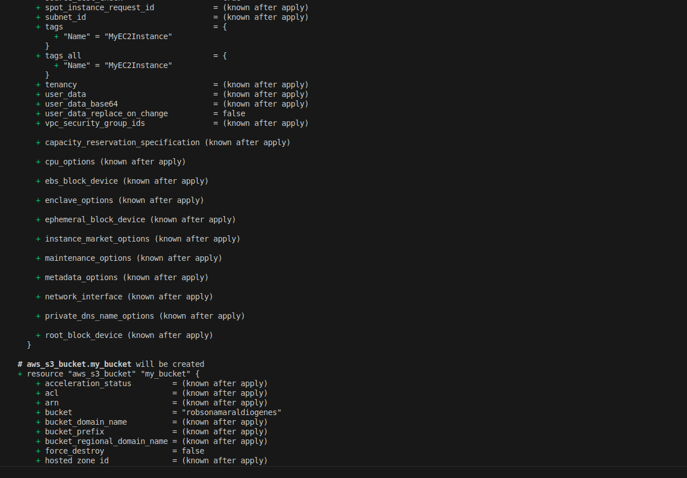
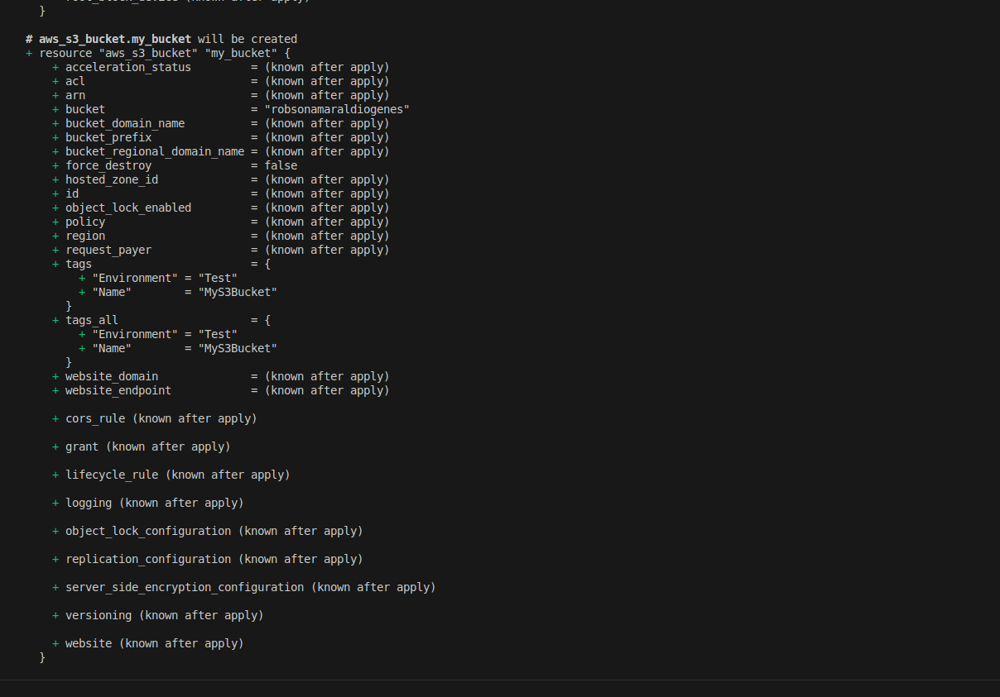
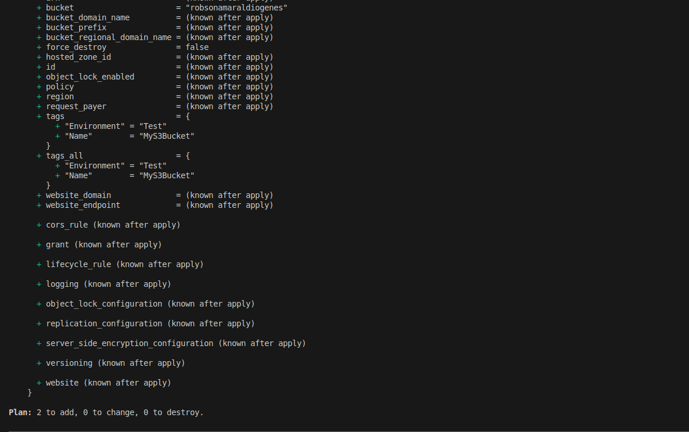

## Aplicação do plano
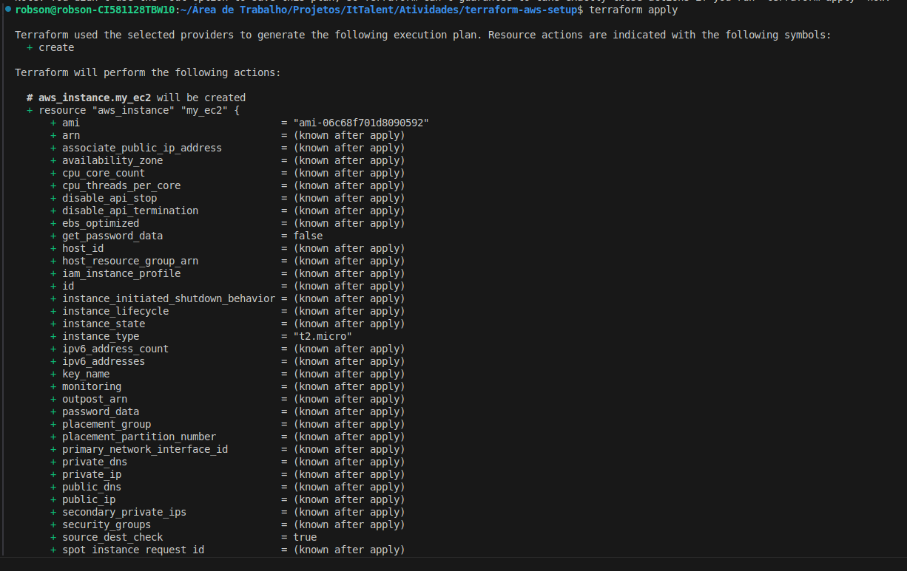
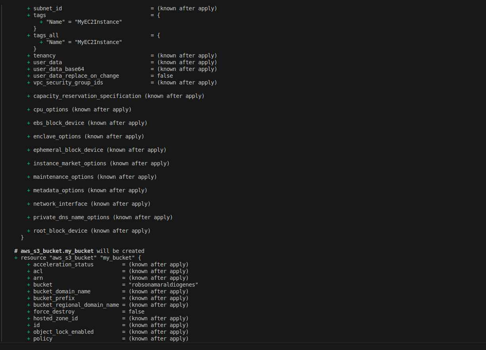
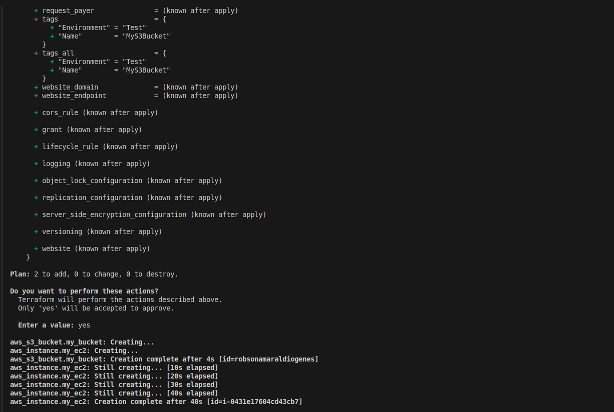
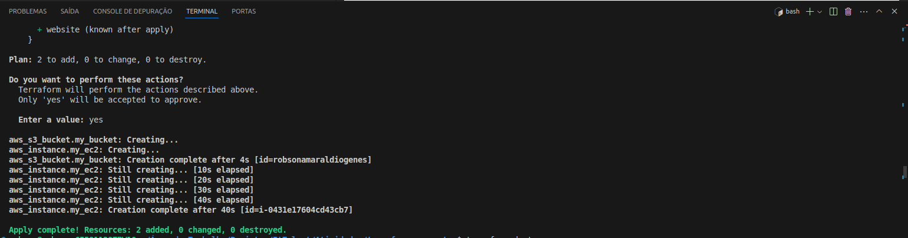

## Verificação da instância EC2
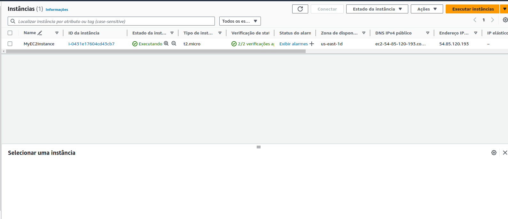

## Verificação do bucket S3
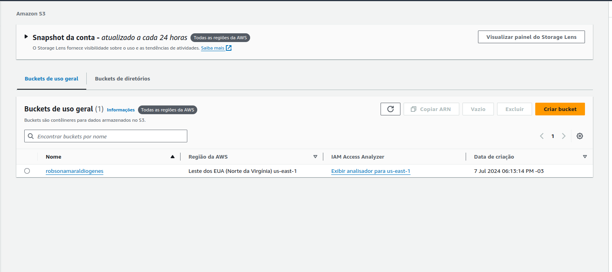
